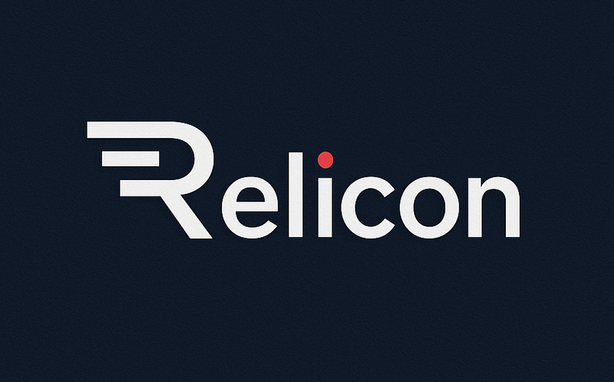

# [Relicon](https://www.relicon.co)

### **Cost-Optimized AI-Driven Short-Form Video Ad Creator System**


A cost-optimized AI-driven platform that autonomously generates high-conversion, brand-ready promotional videos. The platform leverages advanced AI to automate the entire video creation pipeline from ideation to final delivery, producing professional-quality 720p advertisement videos at $1.2-1.6 per video with minimal human intervention.

---

<div align="center">
  <br><br>
  <LeftMouse>
</div>

---

## Overview

Relicon is an enterprise-grade AI-powered video generation platform that creates 15-20 second promotional videos using modern commercial ad structure (Hook → Problem/Solution → Resolution/CTA). The system processes brand information through product-focused visuals, ElevenLabs voiceover and background music at 720p resolution for cost optimization.

## Key Features

* **Cost-Optimized Architecture:** Generates 12-16 videos per $20 budget (vs 4-5 previously)
* **Modern Ad Structure:** Hook → Problem/Solution → Resolution/CTA format with 3 scenes, 6 seconds each
* **Product-Focused Visuals:** Modern commercial advertisements prioritizing product demonstration over talking heads  
* **Professional Audio:** ElevenLabs TTS with mandatory background music at 15% volume
* **Enterprise Logging:** ECS-compliant JSON logging with trace correlation across all services
* **Real-Time Progress:** Enhanced progress tracking with 4-step visual indicators and percentage updates
* **Provider Resilience:** Hailuo-02 (MiniMax) primary, Luma AI fallback for 720p video generation

## Technology Stack

| Area           | Technology                               |
| -------------- | ---------------------------------------- |
| **Frontend**   | Next.js, React, TypeScript, Tailwind CSS |
| **Backend**    | FastAPI, Python, PostgreSQL, Drizzle ORM |
| **AI & ML**    | GPT-4o, LangChain                        |
| **Video**      | Hailuo-02 (MiniMax), Luma AI, FFmpeg     |
| **Audio**      | ElevenLabs, OpenAI TTS                   |
| **Music**      | ElevenLabs Music Generation              |
| **Task Queue** | Celery, Redis                            |
| **Logging**    | Structured JSON, ECS-compliant           |

## Project Structure

```
relicon/ [v0.9.0]
.
├── assets/
│   ├── relicon-full-logo.png
│   └── relicon-logo.png
├── backend/
│   ├── api/
│   └── core/
├── config/
│   ├── env.example
│   ├── __pycache__/
│   └── settings.py
├── core/
│   ├── assembly_service.py
│   ├── audio_service.py
│   ├── cost_tracker.py
│   ├── __init__.py
│   ├── logger.py
│   ├── music_service.py
│   ├── orchestrator.py
│   ├── planning_service.py
│   ├── provider_manager.py
│   ├── __pycache__/
│   └── video_service.py
├── frontend/
│   ├── index.html
│   ├── package.json
│   └── src/
├── __init__.py
├── interfaces/
│   ├── audio_generator.py
│   ├── __init__.py
│   ├── __pycache__
│   ├── text_generator.py
│   └── video_generator.py
├── outputs/
├── package.json
├── providers/
│   ├── elevenlabs.py
│   ├── hailuo.py
│   ├── __init__.py
│   ├── luma.py
│   ├── openai.py
│   └── __pycache__/
├── README.md
├── requirements.txt
├── test/
│   └── test_logging.py
└── utils/
    └── __pycache__/
```

## Quick Start

1. **Clone the repository:**

```bash
git clone https://github.com/aegix-ai/relicon.git
cd relicon
```

2. **Setup environment:**

```bash
pip install -r requirements.txt
cp config/env.example .env
# Add your API keys in .env
```

3. **Launch Development Server:**

```bash
npm run dev
# Server running at http://localhost:5000
```

## Development Roadmap

| Version | Release Date | Major Features                                      |
| ------- | ------------ | --------------------------------------------------- |
| 1.0.0   | 2025-08-18   | Cost-Optimized AI Ad Creator                        |
| 2.0.0   | TBD          | Advanced Feedback Loop & Performance Tracking       |
| 3.0.0   | TBD          | Multi-Provider Optimization & Self-Improvement      |
| 4.0.0   | TBD          | Enterprise Analytics Dashboard & AI Chat Interface  |

## Verified Functionality

* **Cost Optimization:** 720p resolution targeting $1.2-1.6 per 18-second video
* **Modern Ad Structure:** Hook → Problem/Solution → Resolution/CTA with product focus
* **AI Planning:** Autonomous creative decision-making using GPT-4o AutonomousVideoArchitect
* **Video Generation:** Dual-service approach with Hailuo-02 primary, Luma AI fallback
* **Audio Processing:** ElevenLabs TTS + mandatory background music at optimized volume levels
* **Enterprise Logging:** Single-line JSON objects with trace correlation and ECS compliance
* **Real-Time Progress:** 4-step visual indicators with accurate percentage tracking
* **Video Assembly:** FFmpeg-based assembly with precise 18-second duration control

## Architecture Features

* **Single Ad Focus:** ALWAYS creates exactly ONE advertisement with 3 scenes of 6 seconds each
* **No Branching:** No multiple variations or alternative versions - one cohesive 18-second story
* **Cost Controls:** $3 maximum, $2 warning threshold with budget validation
* **Progress Tracking:** Real-time updates every 2 seconds with smooth transitions
* **Service Redundancy:** Primary/fallback pattern for video generation resilience
* **Structured Logging:** Domain-specific fields (video.*, audio.*, cost.*, job.*, orchestration.*)

## Contact & Community

* **Website:** [www.relicon.co](https://www.relicon.co)
* **Email:** [contact@relicon.co](mailto:contact@relicon.co)
* **Twitter:** [@reliconAI](https://twitter.com/reliconAI)


---

> © 2025 Relicon by Aegix Group. All rights reserved.
